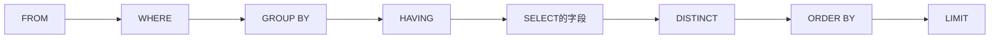
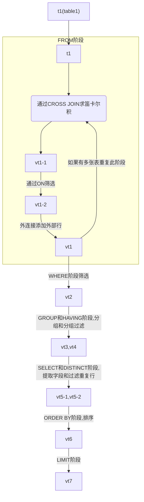

# SELECT 的执行过程

<!-- @import "[TOC]" {cmd="toc" depthFrom=1 depthTo=6 orderedList=false} -->

<!-- code_chunk_output -->

- [SELECT 的执行过程](#select-的执行过程)
  - [查询的结构](#查询的结构)
  - [SELECT 的执行顺序](#select-的执行顺序)
  - [SQL 的执行原理](#sql-的执行原理)

<!-- /code_chunk_output -->

## 查询的结构

```mermaid
flowchart TD
    subgraph one
    a[select....] ---> b["from(从哪些表中选择)....."]
    b ---> c["where(多表的连接条件)"...]
    c ---> d["and(不包含组函数的过滤条件)"...]
    d ---> e["group by(分组的依据)"]
    e ---> f["having(包含组函数的过滤条件)"]
    f ---> g["order by(排序)" ... asc/desc]
    g ---> h["limit(分页)"]
    end
    subgraph two
    a2[select....] ---> b2["from(从哪些表中选择)....JOIN..."]
    b2 ---> b3["ON(多表的连接条件/去除笛卡尔积)"]
    b3 ---> c2["where(不包含组函数的过滤条件)"...]
    c2 ---> d2["and/or(不包含组函数的过滤条件)"...]
    d2 ---> e2["group by(分组的依据)"]
    e2 ---> f2["having(包含组函数的过滤条件)"...]
    f2 ---> g2["order by(排序)" ... asc/desc]
    g2 ---> h2["limit(分页)"]
    end
```

## SELECT 的执行顺序

- 在执行步骤的时候，每个步骤都会产生一个**虚表(vt)**,作为下一个步骤的输入(且用户不可见)

## SQL 的执行原理

$$f(x)=\int_0^xxd(x)$$