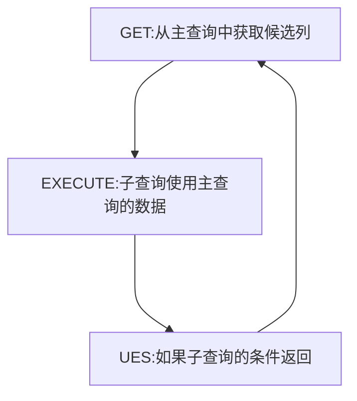

# 子查询

一个查询语句嵌套在另一个查询语句中

<!-- @import "[TOC]" {cmd="toc" depthFrom=1 depthTo=6 orderedList=false} -->

<!-- code_chunk_output -->

- [子查询](#子查询)
  - [子查询的使用](#子查询的使用)
  - [查询的分类](#查询的分类)
    - [单行子查询](#单行子查询)
      - [单行的比较符](#单行的比较符)
      - [子查询中的空值问题](#子查询中的空值问题)
    - [多行子查询](#多行子查询)
    - [相关与不相关](#相关与不相关)
      - [不相关查询](#不相关查询)
      - [相关子查询](#相关子查询)
      - [EXISTS 和 NOT EXISTS 关键字](#exists-和-not-exists-关键字)

<!-- /code_chunk_output -->

---

## 子查询的使用

- 基本用法:

```sql
--子查询
SELECT select_list
FROM table_list
WHERE expr operator
            (SELECT select_list
            FROM table_list);
```

- 举例:

```sql
---举例
SELECT salary,
FROM employees
WHERE salary > (SELECT salary,
                FROM employees
                WHERE last_name ='Abel');
```

- 在 SELECT 中，除了 GROUP BY 和 LIMIT 中，其他位置都可以声明子查询

---

## 查询的分类

### 单行子查询

- 返回一条记录
- 使用单行的比较符

#### 单行的比较符


#### 子查询中的空值问题

- 子查询不会返回任何行

### 多行子查询

- 内查询返回多行
- 使用多行比较符


- 同样的查出空值不会返回任何行

### 相关与不相关

#### 不相关查询

- 子查询查询结果只被执行了一次，然后作为主查询的结果进行执行
- 举例：


#### 相关子查询

- 如果子查询的执行依赖外部查询，每执行一次外部查询，子查询都要重新计算一次，这样的查询称为：**关联子查询**



- 举例


#### EXISTS 和 NOT EXISTS 关键字

- 通常与相关子查询一起使用，用来检查子查询中是否存在满足条件的行

- **EXISTS**
  - 如果条件中不存在满足的行
    - 条件返回 FALSE
    - 继续查找
  - 满足存在的行
    - 不在子查询中继续寻找
    - 条件返回 TRUE
- **NO EXISTS** 则表示不存在返回 TRUE，存在返回 FALSE
