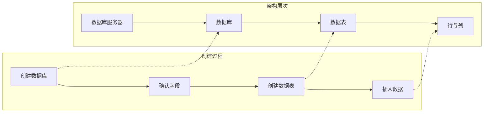

# 表的创造和管理

<!-- @import "[TOC]" {cmd="toc" depthFrom=1 depthTo=6 orderedList=false} -->

<!-- code_chunk_output -->

- [表的创造和管理](#表的创造和管理)
  - [基本介绍](#基本介绍)
    - [一条数据的存储过程](#一条数据的存储过程)
    - [标识符](#标识符)
    - [数据类型](#数据类型)
  - [创建和管理库](#创建和管理库)
    - [创建数据库](#创建数据库)
    - [使用数据库](#使用数据库)
    - [修改数据库](#修改数据库)
    - [删除数据库](#删除数据库)
  - [表的管理](#表的管理)
    - [创建表](#创建表)
    - [查看表结构](#查看表结构)
    - [修改表(增删改查)](#修改表增删改查)

<!-- /code_chunk_output -->

---

## 基本介绍

---

### 一条数据的存储过程



### 标识符

### 数据类型


---

## 创建和管理库

### 创建数据库

```sql
- CREATE DATABASE [数据库名]
- CREATE DATABASE [数据库名] CHARACTER SET [字符集]
- CREATE DATABASE IF NOT EXISTS [数据库名]
```

- **数据库不可改名**

### 使用数据库

```sql
SHOW DATABASE; -- 查看当前所以数据库
SELECT DATABASE(); --查看当前正在使用的数据库
SELECT TABLES FROM 查看指定库下所以的表

--- 查看数据库的创建信息
SHOW CREATE DATABASE [数据库名]
SHOW CREATE DATABASE [数据库名]\

USE [数据库名] --使用/切换数据库
```

### 修改数据库

```sql
ALTER DATABASE [数据库名]  CHARACTER SET [字符集] --更改字符集
```

### 删除数据库

```sql
DROP DATABASE [数据库名]
DROP DATABASE IF EXISTS [数据库名] --删除指定数据库
```

---

## 表的管理

### 创建表

```sql

-- 方式一
CREATE TABLE [IF NOT EXISTS] 表名(
字段1，数据类型 [约束条件] [默认值],
字段2，数据类型 [约束条件] [默认值],
字段3，数据类型 [约束条件] [默认值]
字段4，数据类型 [约束条件] [默认值],
 --
 [表约束条件]
);

--方式二
CREATE TABLE table
        [(column,column)]
AS subquery
```

- 必须具备
  - CREATE TABLE 权限
  - 存储空间
- 必须指定
  - 表名
  - 列名(字段名),数据类型，长度
- 可选指定
  - 约束条件
  - 默认值

### 查看表结构

```sql
SHOW CREATE TABLE 表名\G
```

### 修改表(增删改查)

```sql
-- 追加一个列
ALTER TABLE 表名
ADD [COLUMN] 字段名 字段类型

-- 修改一个列
ALTER TABLE 表名
MODIFY [COLUMN] 字段名 字段类型 [DEFAULT 默认值]

-- 重命名一个列
ALTER TABLE 表名 CHANGE [COLUMN] 列名 新列名 新数据类型

-- 删除一个列
ALTER TABLE 表名 DROP [COLUMN] 字段名

-- 重命名一个表：方式一
RENAME TABLE table1 TO table2
-- 方式二
ALTER table table1
RENAME [T0] table2

-- 删除表(**没有与其他任何数据形成关联**)
DROP TABLE [IF EXISTS] 数据表1 [,数据表2...]

-- 清空表
TRUNCATE TABLE table1 -- 用TRUNCATE 不能回滚

DELETE FROM table2
```
